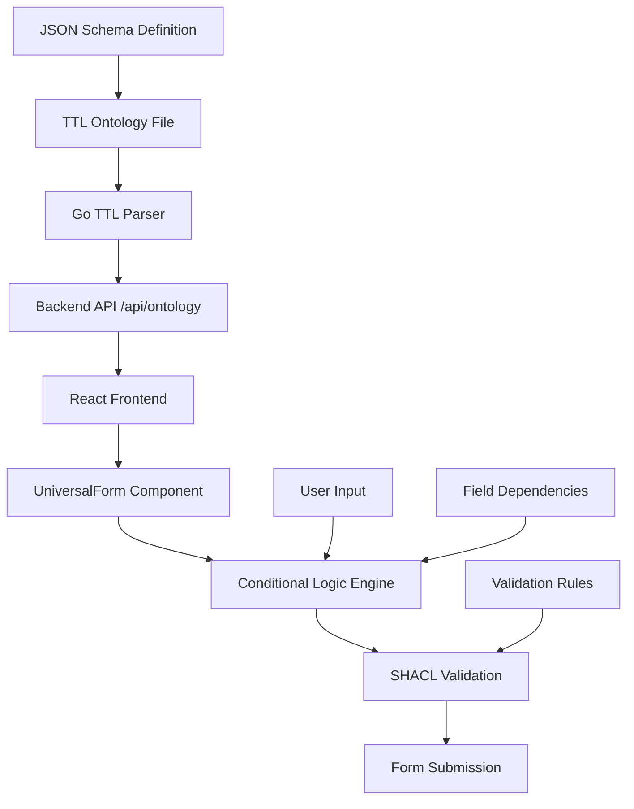

# UK Insurance Driver Licence Schema Documentation

## Overview

This system implements a **JSON Schema compliant, ontology-driven form generation system** for UK car insurance applications. It combines semantic web technologies (RDF/OWL/SHACL) with modern web development to create dynamic, validated forms that automatically adapt based on user input.

## UK Insurance Licence Requirements

UK car insurance companies require comprehensive licence information to assess risk and provide accurate quotes. Here are the standard licence-related questions they need to capture:

### 🔹 Licence Type Questions for Car Insurance Applications

**1. Licence Type / Category**
- Full UK licence (manual or automatic)
- UK provisional licence  
- EU/EEA licence
- International licence
- Other foreign licence

**2. Licence Entitlement**
- Category B (cars) — standard
- Other entitlements (A for motorcycles, C/D for lorries/buses if relevant)

**3. Licence Duration**
- Date licence obtained (day/month/year)
- Years of holding a full licence

**4. Licence Origin**
- Country of issue
- If non-UK: has the licence been exchanged for a UK one? (Y/N)

**5. Driving Restrictions**
- Automatic-only licence (Y/N)
- Any medical conditions declared to DVLA? (Y/N)
- Requirement to wear corrective lenses (glasses/contact lenses)

**6. Penalty Points & Endorsements**
- Current penalty points (number and type, e.g., SP30 speeding, DR10 drink-driving, etc.)
- Disqualifications / bans (dates, duration, reason)
- Pending convictions (Y/N)

**7. Additional Licence Questions**
- Has the licence ever been revoked, refused, or restricted?
- Any pending prosecutions or investigations?
- Any driving tests failed (sometimes asked if still provisional)?

### ✅ Core Insurance Requirements Summary

Insurers typically want:
- **Licence type** (Full UK manual/auto, provisional, EU/foreign)
- **Date first obtained**
- **Country of issue**
- **Any endorsements/points/bans**
- **Any restrictions** (medical, auto-only, vision correction)

Our ontology-driven system captures all these requirements while providing dynamic validation and conditional logic to ensure accurate data collection and compliance with UK insurance standards.

## Architecture Flow



## Core Components

### 1. JSON Schema → TTL Ontology Mapping

**Input JSON Schema:**
```json
{
  "licenceType": {
    "type": "string",
    "enum": ["FULL_UK", "PROVISIONAL_UK", "EU_EEA", "INTERNATIONAL", "OTHER_FOREIGN"],
    "description": "Type of licence held"
  },
  "exchangedToUK": {
    "type": "string",
    "enum": ["YES", "NO"],
    "description": "If non-UK licence, has it been exchanged to a UK licence?"
  }
}
```

**Generated TTL Ontology:**
```turtle
autoins:licenceType a owl:DatatypeProperty ;
  rdfs:domain autoins:Driver ;
  rdfs:range xsd:string ;
  rdfs:label "Licence Type" ;
  autoins:isRequired "true"^^xsd:boolean ;
  autoins:enumerationValues ("FULL_UK" "PROVISIONAL_UK" "EU_EEA" "INTERNATIONAL" "OTHER_FOREIGN") ;
  autoins:formType "select" ;
  autoins:jsonSchemaType "string" ;
  autoins:displayOrder "2.0" .

autoins:exchangedToUK a owl:DatatypeProperty ;
  rdfs:domain autoins:Driver ;
  rdfs:range xsd:string ;
  rdfs:label "Exchanged To UK Licence?" ;
  autoins:isRequired "false"^^xsd:boolean ;
  autoins:conditionalDisplay "licenceType=EU_EEA OR licenceType=INTERNATIONAL OR licenceType=OTHER_FOREIGN" ;
  autoins:enumerationValues ("YES" "NO") ;
  autoins:formType "radio" .
```

### 2. Go Backend Parser (`ttl_parser.go`)

**Key Functions:**
```go
type OntologyField struct {
    Property           string        `json:"property"`
    Label              string        `json:"label"`
    Type               string        `json:"type"`
    Required           bool          `json:"required"`
    IsMultiSelect      bool          `json:"isMultiSelect"`
    FormType           string        `json:"formType"`
    ConditionalDisplay string        `json:"conditionalDisplay,omitempty"`
    EnumerationValues  []string      `json:"enumerationValues"`
    JsonSchemaType     string        `json:"jsonSchemaType,omitempty"`
    JsonSchemaPattern  string        `json:"jsonSchemaPattern,omitempty"`
}
```

**Parsing Regex Patterns:**
```go
conditionalDisplayPattern := regexp.MustCompile(`(autoins|docs|):conditionalDisplay\s+"([^"]+)"\s*;`)
enumPattern := regexp.MustCompile(`(autoins|docs|):enumerationValues\s+\(([^)]+)\)\s*;`)
formTypePattern := regexp.MustCompile(`(autoins|docs|):formType\s+"([^"]+)"\s*;`)
```

### 3. API Response Structure

**GET /api/ontology Response:**
```json
{
  "sections": {
    "drivers": {
      "fields": [
        {
          "property": "licenceType",
          "label": "Licence Type",
          "type": "select",
          "required": true,
          "enumerationValues": ["FULL_UK", "PROVISIONAL_UK", "EU_EEA", "INTERNATIONAL", "OTHER_FOREIGN"],
          "formType": "select",
          "jsonSchemaType": "string"
        },
        {
          "property": "exchangedToUK",
          "label": "Exchanged To UK Licence?",
          "type": "radio",
          "required": false,
          "conditionalDisplay": "licenceType=EU_EEA OR licenceType=INTERNATIONAL OR licenceType=OTHER_FOREIGN",
          "enumerationValues": ["YES", "NO"],
          "formType": "radio"
        }
      ]
    }
  }
}
```

### 4. React Frontend Conditional Logic

**UniversalForm.tsx - Conditional Display Engine:**
```typescript
const shouldDisplayField = (field: OntologyField): boolean => {
  if (field.conditionalDisplay) {
    const condition = field.conditionalDisplay;
    
    // Handle OR conditions
    if (condition.includes(' OR ')) {
      const orConditions = condition.split(' OR ');
      return orConditions.some(orCondition => evaluateCondition(orCondition.trim(), data));
    }
    
    return evaluateCondition(condition, data);
  }
  return true;
};

const evaluateCondition = (condition: string, data: any): boolean => {
  if (condition.includes('=')) {
    const [fieldName, value] = condition.split('=');
    const currentValue = data[fieldName.trim()];
    const expectedValue = value.trim();
    
    if (expectedValue === 'YES') {
      return currentValue === 'YES' || currentValue === true;
    }
    return currentValue === expectedValue;
  }
  return true;
};
```

## Field Types & Rendering Examples

### 1. Single Select Dropdown
**Ontology Definition:**
```turtle
autoins:licenceType a owl:DatatypeProperty ;
  autoins:formType "select" ;
  autoins:enumerationValues ("FULL_UK" "PROVISIONAL_UK" "EU_EEA") .
```

**Rendered HTML:**
```html
<select name="licenceType">
  <option value="">Select Licence Type</option>
  <option value="FULL_UK">Full UK</option>
  <option value="PROVISIONAL_UK">Provisional UK</option>
  <option value="EU_EEA">EU EEA</option>
</select>
```

### 2. Multi-Select Checkboxes
**Ontology Definition:**
```turtle
autoins:licenceCategory a owl:DatatypeProperty ;
  autoins:isMultiSelect "true"^^xsd:boolean ;
  autoins:enumerationValues ("B" "A" "C" "D") .
```

**Rendered HTML:**
```html
<div class="space-y-2">
  <label class="flex items-center">
    <input type="checkbox" name="licenceCategory" value="B" />
    <span>B - Cars & small vans</span>
  </label>
  <label class="flex items-center">
    <input type="checkbox" name="licenceCategory" value="A" />
    <span>A - Motorcycles</span>
  </label>
</div>
```

### 3. Radio Buttons (Yes/No)
**Ontology Definition:**
```turtle
autoins:hasMedicalConditions a owl:DatatypeProperty ;
  autoins:formType "radio" ;
  autoins:enumerationValues ("YES" "NO") ;
  autoins:triggerSection "medical" .
```

**Rendered HTML:**
```html
<div class="flex items-center space-x-4">
  <label class="flex items-center">
    <input type="radio" name="hasMedicalConditions" value="NO" checked />
    <span>No</span>
  </label>
  <label class="flex items-center">
    <input type="radio" name="hasMedicalConditions" value="YES" />
    <span>Yes</span>
  </label>
</div>
```

## Conditional Logic Examples

### 1. Simple Conditional Display
**Rule:** Show "exchangedToUK" only if licence type is non-UK

**Ontology:**
```turtle
autoins:exchangedToUK a owl:DatatypeProperty ;
  autoins:conditionalDisplay "licenceType=EU_EEA OR licenceType=INTERNATIONAL OR licenceType=OTHER_FOREIGN" .
```

**Logic Flow:**
1. User selects `licenceType = "FULL_UK"` → `exchangedToUK` field **hidden**
2. User selects `licenceType = "EU_EEA"` → `exchangedToUK` field **shown**

### 2. Collapsible Section Trigger
**Rule:** Show medical conditions section only if user has medical conditions

**Ontology:**
```turtle
autoins:hasMedicalConditions a owl:DatatypeProperty ;
  autoins:formType "radio" ;
  autoins:triggerSection "medical" ;
  autoins:sectionCollapsible "true"^^xsd:boolean ;
  autoins:sectionDefaultClosed "true"^^xsd:boolean .

autoins:medicalConditionTypes a owl:DatatypeProperty ;
  autoins:conditionalDisplay "hasMedicalConditions=YES" ;
  autoins:formSection "medical" .
```

**UI Behavior:**
1. **Initial State:** Medical section collapsed, only "Any Medical Conditions?" visible
2. **User selects "NO":** Section remains collapsed
3. **User selects "YES":** Section expands, showing medical condition details

### 3. Array/Repeatable Fields
**Rule:** Show endorsement details array if user has endorsements

**Ontology:**
```turtle
autoins:hasEndorsements a owl:DatatypeProperty ;
  autoins:formType "radio" ;
  autoins:triggerSection "endorsements" .

autoins:endorsementCode a owl:DatatypeProperty ;
  rdfs:domain autoins:Endorsement ;
  autoins:conditionalDisplay "hasEndorsements=YES" ;
  autoins:formSection "endorsements" .
```

## SHACL Validation Rules

### 1. Basic Required Field Validation
```turtle
autoins:LicenceValidationShape a sh:NodeShape ;
  sh:targetClass autoins:Driver ;
  sh:property [
    sh:path autoins:licenceType ;
    sh:minCount 1 ;
    sh:in ("FULL_UK" "PROVISIONAL_UK" "EU_EEA" "INTERNATIONAL" "OTHER_FOREIGN") ;
    sh:message "Licence type is required and must be valid"
  ] .
```

### 2. Conditional Field Validation
```turtle
autoins:NonUKLicenceExchangeShape a sh:NodeShape ;
  sh:targetClass autoins:Driver ;
  sh:condition [
    sh:property [
      sh:path autoins:licenceType ;
      sh:in ("EU_EEA" "INTERNATIONAL" "OTHER_FOREIGN")
    ]
  ] ;
  sh:property [
    sh:path autoins:exchangedToUK ;
    sh:minCount 1 ;
    sh:message "Non-UK licences must specify if exchanged to UK licence"
  ] .
```

### 3. Cross-Field Validation
```turtle
autoins:UKLicenceCountryShape a sh:NodeShape ;
  sh:targetClass autoins:Driver ;
  sh:condition [
    sh:property [
      sh:path autoins:licenceType ;
      sh:hasValue "FULL_UK"
    ]
  ] ;
  sh:property [
    sh:path autoins:countryOfIssue ;
    sh:hasValue "UK" ;
    sh:message "UK licence must have UK as country of issue"
  ] .
```

## Complete Form Flow Example

### Scenario: User with EU Licence and Medical Conditions

**Step 1: Initial Form Load**
```json
{
  "licenceType": null,
  "hasMedicalConditions": "NO"
}
```
- Only basic licence fields visible
- Medical section collapsed
- Exchange field hidden

**Step 2: User Selects EU Licence**
```json
{
  "licenceType": "EU_EEA",
  "hasMedicalConditions": "NO"
}
```
- `exchangedToUK` field appears (conditional display triggered)
- Medical section still collapsed

**Step 3: User Indicates Medical Conditions**
```json
{
  "licenceType": "EU_EEA",
  "exchangedToUK": "YES",
  "hasMedicalConditions": "YES"
}
```
- Medical section expands
- `medicalConditionTypes` multi-select appears
- `medicalDeclaredToDVLA` radio buttons appear

**Step 4: Validation Check**
```typescript
// SHACL validation runs automatically
const validationErrors = [
  // No errors - all conditional requirements met
];
```

## File Structure

```
client-ux/
├── ontology/
│   ├── AI_Driver_Details.ttl              # Main driver ontology
│   └── AI_Driver_Licence_Schema.ttl       # JSON Schema compliant licence ontology
├── insurance-frontend/src/
│   ├── components/forms/
│   │   ├── UniversalForm.tsx               # Main form renderer
│   │   └── LicenceFormHandler.tsx          # JSON Schema validation
│   └── types/
│       ├── index.ts                        # Core types
│       └── licence.ts                      # Licence-specific types
├── ttl_parser.go                           # Ontology parser
├── types.go                                # Go data structures
└── main.go                                 # API handlers
```

## Key Properties Reference

### Ontology Properties
| Property | Purpose | Example |
|----------|---------|---------|
| `autoins:isRequired` | Field validation | `"true"^^xsd:boolean` |
| `autoins:formType` | UI component type | `"radio"`, `"select"`, `"text"` |
| `autoins:isMultiSelect` | Multi-value fields | `"true"^^xsd:boolean` |
| `autoins:conditionalDisplay` | Show/hide logic | `"licenceType=EU_EEA"` |
| `autoins:enumerationValues` | Option lists | `("YES" "NO")` |
| `autoins:triggerSection` | Section control | `"medical"` |
| `autoins:sectionCollapsible` | Collapsible UI | `"true"^^xsd:boolean` |
| `autoins:jsonSchemaType` | JSON Schema mapping | `"string"`, `"array"` |
| `autoins:jsonSchemaPattern` | Regex validation | `"^[A-Z]{2}\\d{2}$"` |

### Conditional Display Operators
| Operator | Purpose | Example |
|----------|---------|---------|
| `=` | Equals | `"licenceType=FULL_UK"` |
| `!=` | Not equals | `"driverType!=MAIN_DRIVER"` |
| `OR` | Logical OR | `"licenceType=EU_EEA OR licenceType=INTERNATIONAL"` |

## Benefits

1. **Single Source of Truth**: Ontology defines both structure and validation
2. **Automatic UI Generation**: Forms render automatically from ontology
3. **JSON Schema Compliance**: Industry-standard validation rules
4. **Conditional Logic**: Complex form flows without hardcoding
5. **GDPR Compliance**: Built-in data classification and retention
6. **Internationalization**: Multi-language support via RDF literals
7. **Type Safety**: Full TypeScript integration
8. **Validation**: Real-time SHACL-based validation

This system provides a robust, maintainable approach to complex form generation that scales with business requirements while maintaining compliance and user experience standards.
